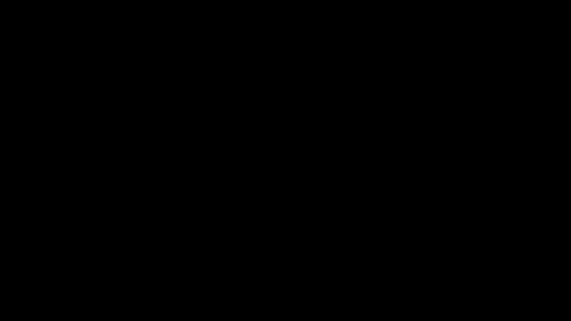

# Backpropagation in Neural Networks — Lecture

This repository contains material for a short, self-contained lecture on **Backpropagation in Neural Networks**.

## Contents

- **Slides (PDF):** `Backpropagation.pdf`
- **Manim animations:** `Animations/` (source code + rendering setup)
- **Preview video:** `Animations/media/videos/backprop_mini/480p15/BackpropMini.mp4`

## What to expect (high-level)

1. Quick recap: neural networks as function compositions (parameters + activations)
2. Loss minimization and gradient descent intuition
3. Backpropagation via the chain rule (forward pass → local gradients → backward pass)

## Preview

[](Animations/media/videos/backprop_mini/480p15/BackpropMini.mp4)

MP4: [`BackpropMini.mp4`](Animations/media/videos/backprop_mini/480p15/BackpropMini.mp4)

## Manim animations (uv)

This project uses **uv** for dependency management.

### Setup

```bash
uv sync
